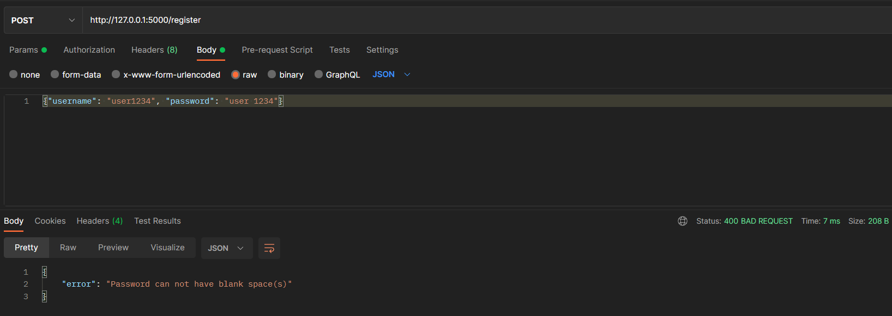

# IOT API

A simple IOT API which can:

    - register users
    - allow users to login
    - allow users to apply for loan using JWT
    - allow users to create device using JWT
    - allow users to update device name
    - allow users to send data to a sensor, API automatically inserts new record for each sensor data updates
    - allow users to get sensor data for a given time window which is queryable 


### Requirements

You will need Python and virtualenv module installed. Remaning will be installed via requriements.txt.

### Install

Clone the repo, create a virtualenv and install the requirements:

```
git clone https://github.com/AmitBanikOfficial/iot-api.git
cd iot-api
virtualenv iotapienv
for Windows:
iotapienv\Scripts\activate
for linux/mac:
source iotapienv/bin/activate
pip install -r requirements
```

### Run 

```
for Windows:
python app.py
for linux/mac:
python3 app.py
```

### Routes

```
http://127.0.0.1:5000/register
http://127.0.0.1:5000/login
http://127.0.0.1:5000/create_device
http://127.0.0.1:5000/send_data_to_sensor
http://127.0.0.1:5000/update_device_name
http://127.0.0.1:5000/get_sensor_data_over_time_query
```

### API

#### Register User

```
http://127.0.0.1:5000/register
```
Method  - POST

Accepts - username(str), password(str) - in form of JSON

Returns - JSON

Username length validation:


Username type validation:


Password length validation:


Password type validation:


Username already taken validation:


Registering a normal user with missing details:


Registering a user with proper details:


After successfull registration, User table looks like:


#### Login User

```
http://127.0.0.1:5000/login
```

Method  - POST 

Accepts - username(str), password(str) in form of JSON

Returns - JSON, if successfull then with Access Token

If the user does not exist in the database:


If user provides incorrect password:


Successfull user login:


#### Create Device

```
http://127.0.0.1:5000/create_device
```

Method  - POST 

Accepts - device_name(str) in form of JSON, requires access token as Authorization

Returns - JSON, with device name, unique device id, unique temperature sensor id, default temperature sensor value as 0.0 (float),unique pressure sensor id, default pressure sensor value as 0.0 (float), reported at - datetimestamp upto milliseconds

Create device:


Create device with missing information:


Device data in database after successfull addition:


#### Send data to a sensor

```
http://127.0.0.1:5000/send_data_to_sensor
```

Method  - PUT 

Accepts - sensor_id(str), sensor_value(float) in form of JSON, requires access token as Authorization

Returns - JSON


Sending data with exisitng sensor id:


Database details after sending data with exisitng sensor id:


Sending data with non-exisitng sensor id:


#### Update device name

```
http://127.0.0.1:5000/update_device_name
```

Method  - PUT 

Accepts - old_device_name(str), new_device_name(str) in form of JSON, requires access token as Authorization

Returns - JSON

Update existing device name:


Update non-existing device name:


Database after updating exisitng device:


#### Get sensor data over time

```
http://127.0.0.1:5000/get_sensor_data_over_time_query
```

Method  - GET 

Accepts - name(str), from(str) and to(str) in form of parameter, requires access token as Authorization

Returns - JSON

Get data for existing sensor over a period of time:


Get data for non existing sensor over a period of time:


## Run Unit tests

```
cd iot-api
python test_app.py
```


